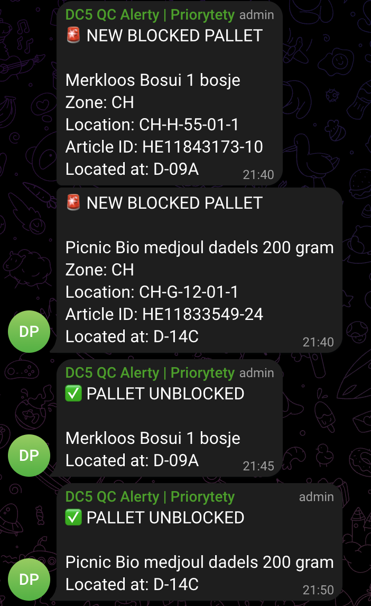

# 🚨 Telegram Priority Bot

A Telegram bot powered by Google Apps Script that monitors a Google Sheets document and sends real-time notifications when new blocked pallets appear — built for warehouse quality control workflows.

## The Problem

In a warehouse quality control environment, blocked pallets require 
immediate inspection before pickers can fulfill customer orders. 
Previously, QC controllers had to manually check a shared Google Sheet 
on their laptops to spot new priorities — a process that created delays, 
especially during peak hours when up to 6 blocked pallets could appear 
simultaneously.

With ~10 people working on the same document, there was no clear way 
to coordinate who was handling which pallet, leading to duplicated 
efforts or missed priorities altogether. Every minute of delay meant 
slower order fulfillment and late deliveries.

## The Solution

This bot monitors the shared spreadsheet in real-time and instantly 
pushes notifications to a Telegram group shared by the entire QC team. 
When a new blocked pallet appears, everyone is notified at the same time 
— no more manual checking. Team members can dynamically claim priorities 
directly in the group chat, making the workflow faster and more 
transparent.

The result: blocked pallets get resolved faster, pickers can do their 
job without waiting, and orders leave the warehouse on time.

## Features

- 🚨 Instant notification when a new blocked pallet appears
- ✅ Notification when a pallet is unblocked
- 👥 Supports multiple recipients (individuals or group chat)
- ⚡ Runs automatically every minute via Google Apps Script triggers

## How it works

1. Google Apps Script checks the spreadsheet every minute
2. Compares current rows with previously known state
3. Detects new or resolved pallets
4. Sends formatted Telegram messages to all configured recipients

## Screenshots



## Setup

### 1. Create a Telegram Bot

1. Open Telegram and search for **@BotFather**
2. Send `/newbot`
3. Choose a display name (e.g. `DC5 QC Alerts | Priorities`)
4. Choose a username ending in `bot` (e.g. `dc5_qc_priorities_bot`)
5. BotFather will reply with a **token** — save it for later

### 2. Get your Chat ID

1. Search for your new bot on Telegram and send `/start`
2. Open this URL in your browser (replace `YOUR_TOKEN`):
```
https://api.telegram.org/botYOUR_TOKEN/getUpdates
```
3. Find the `"id"` field inside the `"chat"` object — that's your chat ID

> 💡 Alternatively, send `/start` to [@userinfobot](https://t.me/userinfobot) — it will reply with your chat ID instantly.

### 3. Set up Google Apps Script

1. Go to [drive.google.com](https://drive.google.com) and create a new Google Sheet
2. Click **Extensions → Apps Script**
3. Delete the default code
4. Paste the contents of `Code.gs` from this repo
5. Fill in your values at the top of the file:
   - `TELEGRAM_TOKEN` — token from BotFather
   - `RECIPIENTS` — your chat ID, e.g. `["123456789"]`
   - `SOURCE_SHEET_ID` — the ID from your spreadsheet URL (`/spreadsheets/d/THIS_PART/edit`)
   - `SHEET_NAME` — name of the tab in your spreadsheet
6. Click **Save** (💾)

### 4. Authorize the script

1. Click **Run → checkForNewPicks**
2. A popup will appear — click **Review permissions**
3. Select your Google account
4. Click **Advanced → Go to (unsafe)** — this is your own script, it's safe
5. Click **Allow**

### 5. Set up automatic trigger

1. In Apps Script click the clock icon (**Triggers**) in the left sidebar
2. Click **+ Add Trigger** in the bottom right
3. Configure:
   - Function: `checkForNewPicks`
   - Event source: `Time-driven`
   - Type: `Minutes timer`
   - Interval: `Every minute`
4. Click **Save** and authorize again if prompted

### 6. Optional: Use a group chat

Instead of individual notifications you can send alerts to a Telegram group:

1. Create a group and add your bot as a member
2. Make the bot an admin with **Send Messages** permission
3. Send any message in the group, then visit the `getUpdates` URL
4. Find the group `"id"` (starts with `-`) and add it to `RECIPIENTS`

## Tech stack

- Google Apps Script (JavaScript)
- Telegram Bot API
- Google Sheets API (read-only access)

## License

MIT
